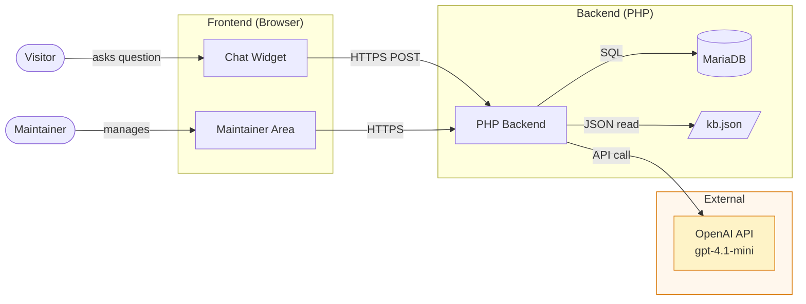

# AI UI Assistant

A context-aware AI assistant integrated into a web UI showcase.
Built as a portfolio project to demonstrate Business Analysis,
Architecture and AI integration skills.

> Status: Work in progress - initial setup phase.

## Goal

Provide users with domain-specific UI guidance via a controlled,
secure AI assistant - without becoming a generic chatbot.

The assistant answers questions about:
- Buttons and their function
- Status values and transitions
- Process steps
- Mandatory fields and business rules

## Scope clarification

This AI project is an add-on to a UI showcase that contains its
own business roles (User, Admin). Those roles are part of the
showcase application logic and are not affected by the AI layer.

The AI assistant introduces two separate technical roles:

| Role        | Description |
|-------------|-------------|
| Visitor     | Opens the chat to ask UI questions. |
| Maintainer  | Project owner. Manages prompts, knowledge base and logs. |

## Stack

- **Backend**: PHP
- **Database**: MariaDB
- **Frontend**: HTML / JavaScript
- **AI**: OpenAI API (gpt-4.1-mini)

## System architecture



## Documentation

- [Architecture](docs/architecture.md)
- [Decisions (ADR)](docs/decisions.md)
- [Playground Test Protocol](docs/playground-test.md)
- [Cost Estimation](docs/cost-estimation.md)

## Setup

The project is bootstrapped via a single PowerShell script:

```powershell
.\setup.ps1
```

Pre-requisite: a local `.env` file with the real `OPENAI_API_KEY`
must exist before running the script. The `.env` is gitignored
and never reaches GitHub.

## Repository structure

```
.
├── docs/                   BA documentation, decisions, diagrams
├── knowledge_base/         Domain knowledge as versioned JSON
├── backend/                PHP code
│   ├── api/                Public endpoints
│   ├── lib/                Internal helpers
│   └── config/prompts/     Versioned system prompts
├── frontend/               HTML / JS
│   └── maintainer/         Prompt editor (login required)
├── database/               SQL schema
└── setup.ps1               Reproducible project bootstrap
```

## Author

Andreas Beekma - Senior Business Analyst
[andreas.beekma.ch](https://andreas.beekma.ch)
