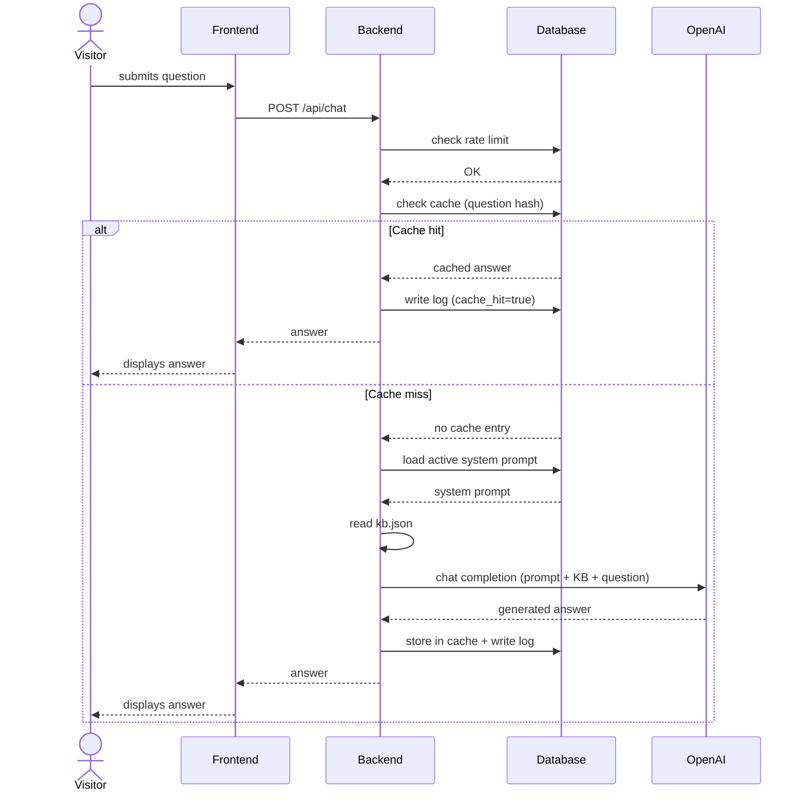
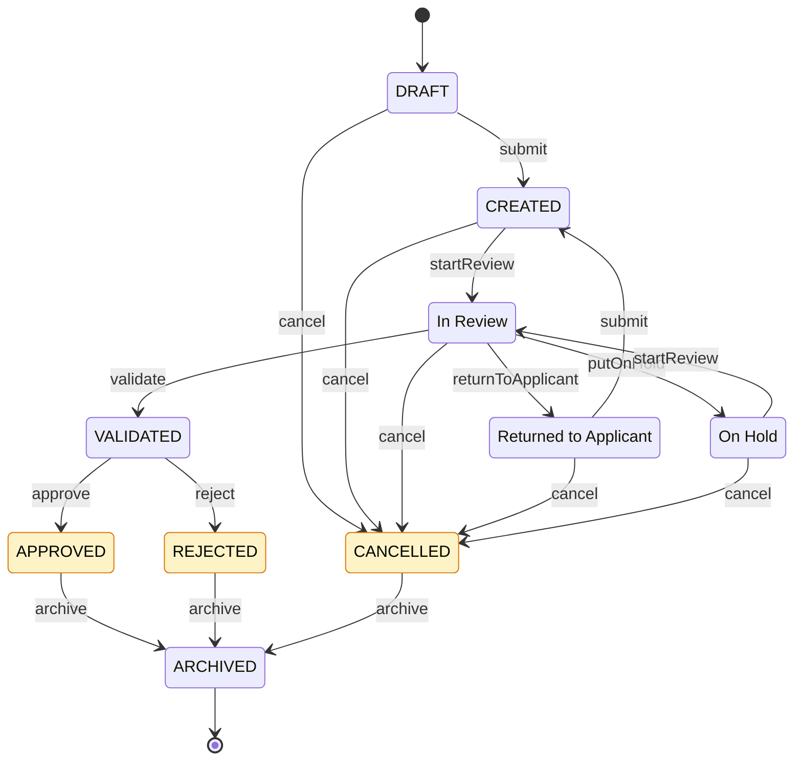

# Architecture

## Overview

The AI UI Assistant is a thin layer on top of an existing UI showcase.
It uses OpenAI's API as the language model and adds three layers
of control around it:

1. **Knowledge Base** - structured domain information (JSON)
2. **System Prompt** - behavioural constraints for the LLM
3. **Backend Proxy** - rate limiting, caching, logging, security

## Component diagram

```
+-----------------------------------------------------+
|  Frontend                                           |
|  +-- Chat widget (Visitor)                          |
|  +-- Logs dashboard (Maintainer, login)             |
|  +-- Prompt editor   (Maintainer, login)            |
+-----------------------------------------------------+
                         |
                         v  HTTPS
+-----------------------------------------------------+
|  PHP Backend                                        |
|  +-- chat.php        OpenAI proxy                   |
|  +-- logs.php        delivers log entries           |
|  +-- maintainer.php  prompt management              |
|  +-- middleware/                                    |
|       +-- rate_limit.php                            |
|       +-- cache.php          (hash-based)           |
|       +-- auth.php           (HTTP Basic Auth v1)   |
+-----------------------------------------------------+
                         |
                         v
+-----------------------------------------------------+
|  MariaDB                                            |
|  +-- logs            requests, tokens, cost         |
|  +-- prompts         versioned system prompts       |
|  +-- cache           question hash -> answer        |
|  +-- rate_limits     IP + time window               |
+-----------------------------------------------------+
                         |
                         v
              knowledge_base/kb.json
              (versioned in Git)
                         |
                         v
                 OpenAI API
```

## Request flow



## Application status lifecycle



## Key principles

- **Knowledge Base in Git, not DB**: human-readable, reviewable,
  versioned alongside the code.
- **System prompts versioned in DB**: editable at runtime through
  the maintainer UI without redeployment.
- **API key only in backend**: never exposed to the browser.
- **Rate limiting at two levels**: per IP per hour + global per day.
- **Caching first**: identical questions are served from DB cache,
  not from OpenAI - cost optimisation.

## Security layers

1. API key isolation (backend `.env` only)
2. Input validation (length, characters)
3. Rate limiting (IP + global)
4. System prompt restricts answer scope
5. Output token limit (200 max)
6. Maintainer area behind authentication
7. Logging of all requests (audit trail)
